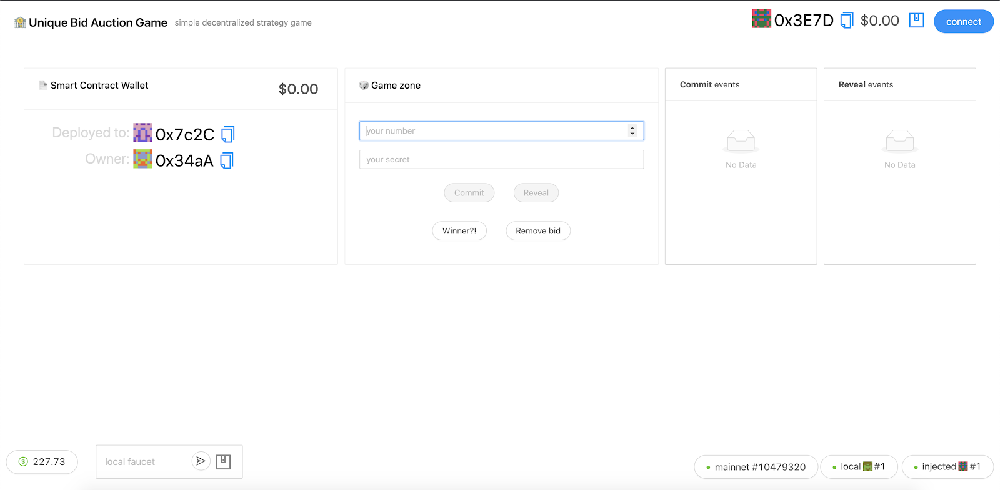
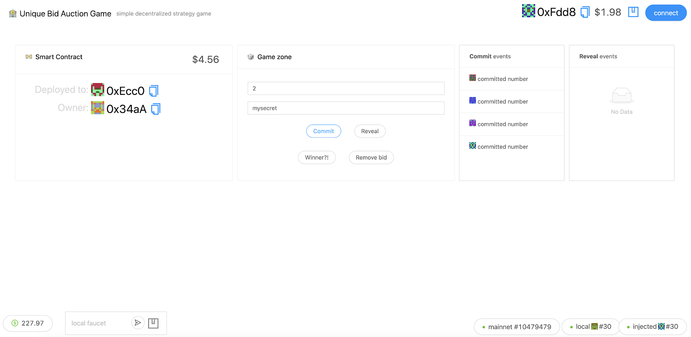
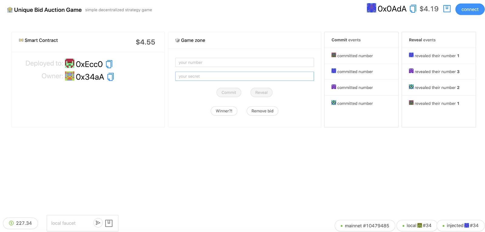
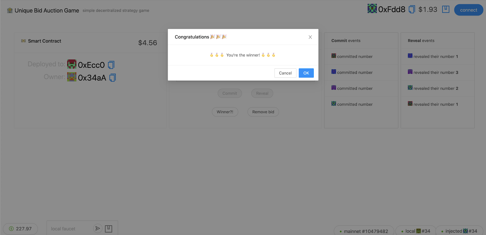

# 🏦 Unique Bid Auction 
[](https://github.com/pavponn/watcher/blob/master/LICENSE)

Decentralized Unique Bid Action game implemented using Solidity (for smart contracts) & React for frontend.
Poject based on [scaffold-eth](https://github.com/austintgriffith/scaffold-eth) by [Austin Griffith](https://github.com/austintgriffith).

---

## ⏱ Quickstart:

First, you'll need [NodeJS>=10](https://nodejs.org/en/download/) plus [Yarn](https://classic.yarnpkg.com/en/docs/install/) and [Git](https://git-scm.com/downloads) installed.

💾 Clone/fork repo and then install:

```bash
git clone https://github.com/pavponn/unique-bid-dapp.git

cd unique-bid-dapp

yarn install
```

> 💡 Sometimes the install throws errors like "node-gyp", try the next step even if you see problems.<br/>
> (You can also [download the Apple command line tools](https://developer.apple.com/download/more/) to fix the warning.)

---

⚛️ [React](https://reactjs.org/tutorial/tutorial.html) frontend powered by 📱[create-eth-app](https://github.com/PaulRBerg/create-eth-app) using 🔧[Ethers.js](https://docs.ethers.io/ethers.js/html/index.html) and the 🦄[Uniswap](https://uniswap.org/docs/v1) template:

```bash
yarn start
```

📝 Edit your frontend `App.js` in `packages/react-app/src` and open http://localhost:3000

---

⛓ Start your local blockchain powered by 👷‍♀️[Buidler](https://buidler.dev/tutorial/):

```bash
yarn run chain
```

**Note**: You'll need to run this command in a new terminal window

> 🛠 [Use this eth.build](https://eth.build/build#1a21b864c6bcdb901070b64965fae825cdfc11b1915d74f058f00b114a8c129a) to double-check your local chain and account balances

## Other commands

⚙️ Compile your contracts:

```bash
yarn run compile
```

🚢 Deploy your contracts to the frontend:

```bash
yarn run deploy
```

🔍 _Watch_ for changes then compile, deploy, and hot reload the frontend:

```bash
yarn run watch
```

---

🔬Test your contracts by editing `myTest.js` in `packages/buidler/contracts`:

```bash
yarn run test
```

🗝 List your local accounts:

```bash
yarn run accounts
```

💰 Check account balance:

```bash
yarn run balance **YOUR-ADDRESS**
```

💸 Send ETH:

```bash
yarn run send --from 0 --amount 0.5 --to **YOUR-ADDRESS**
```

> 🔧 Configure 👷[Buidler](https://buidler.dev/config/) by editing `buidler.config.js` in `packages/buidler`

---

✨ The [BuidlerEVM](https://buidler.dev/buidler-evm/) provides _stack traces_ and _console.log_ debugging for our contracts ✨

---


## Screenshots



---

 

---



---

 


## Copyright 

Pavel Ponomarev, 2020 (pavponn@gmail.com)

MIT License.
